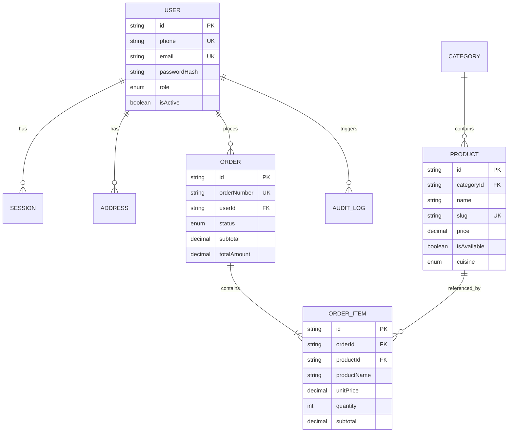

# Database Architecture & Design

## 1. Overview

The primary data store is **PostgreSQL 16**, managed through **Prisma ORM** and declarative migrations.

PostgreSQL serves as the sole source of truth for business-critical data (menu items, pricing, user accounts, orders, payments, and audit events).

---

## 2. Core Entities

---

## 3. Key Design Decisions

### Immutability of Historical Orders

When an order is created, `OrderItem` records duplicate the `productName` and `unitPrice` as a permanent financial snapshot. If the restaurant later increases the price of "Dal Makhani", previously placed historical orders remain unchanged.

### Indexing Strategy

- **Users**: Unique index on `phone` and `email`, index on `role`.
- **Products**: Unique index on `slug`, composite indexes on `[categoryId]`, `[cuisine]`, and `[isAvailable]` to accelerate customer menu queries.
- **Orders**: Unique index on `orderNumber`, indexes on `userId`, `status`, and `createdAt` for rapid customer order history and kitchen queue retrieval.
- **Audit Logs**: Composite indexes on `[entity, entityId]`, `[userId]`, and `[createdAt]`.

### Monies and Decimal Precision

All prices and totals use `Decimal(10, 2)` to eliminate floating-point arithmetic errors.
