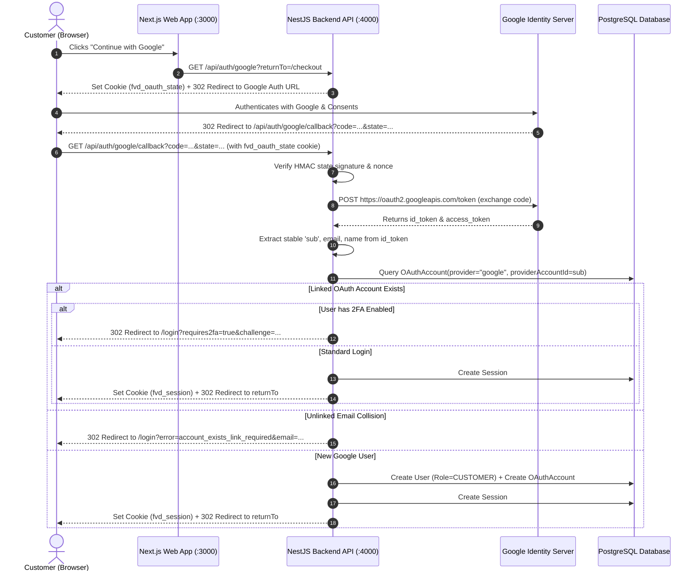

# Google OAuth 2.0 & OpenID Connect Authentication

This document details the architecture, setup instructions, security safeguards, and implementation details for **"Continue with Google"** authentication at Family Vaishno Dhaba.

---

## 1. Architecture Overview

Google Authentication in Family Vaishno Dhaba is built directly on OpenID Connect (OIDC) standards and integrates seamlessly into the existing HTTP-only cookie-based session architecture.



---

## 2. Environment Variables & Setup

### Required Variables

Add the following environment variables to `apps/api/.env`:

```env
# Google OAuth 2.0 Credentials
GOOGLE_CLIENT_ID="your-google-client-id.apps.googleusercontent.com"
GOOGLE_CLIENT_SECRET="GOCSPX-your-google-client-secret"
GOOGLE_CALLBACK_URL="http://localhost:4000/api/auth/google/callback"
```

### Google Cloud Console Configuration

1. Visit [Google Cloud Console](https://console.cloud.google.com/).
2. Create or select a Project (e.g., `family-vaishno-dhaba`).
3. Configure the **OAuth Consent Screen**:
   - User Type: **External**
   - App Name: `Family Vaishno Dhaba`
   - User support email & Developer contact info
   - Scopes: `openid`, `userinfo.email`, `userinfo.profile`
4. Create **OAuth 2.0 Client ID**:
   - Application Type: **Web application**
   - Name: `Family Vaishno Dhaba Web Client`
   - Authorized JavaScript origins:
     - Development: `http://localhost:3000`, `http://localhost:4000`
     - Production: `https://familyvaishnodhaba.com`, `https://api.familyvaishnodhaba.com`
   - Authorized redirect URIs:
     - Development: `http://localhost:4000/api/auth/google/callback`
     - Production: `https://api.familyvaishnodhaba.com/api/auth/google/callback`
5. Copy the Client ID and Client Secret into your `.env` configuration.

---

## 3. Security Architecture & Safeguards

### 1. Account Takeover Prevention (No Silent Auto-Linking)

- If a Google account is already linked via `OAuthAccount(provider="google", providerAccountId=sub)`, the user is authenticated.
- If a user attempts to sign in with Google and their email matches an existing password-based customer account **without an active link**, the backend **will not silently link the account**.
- Instead, it redirects to `/login?error=account_exists_link_required&email=...`, prompting the user to sign in with their password first and link Google from `/account`.
- This strictly prevents pre-account takeover attacks where an adversary creates a Google account with a victim's email address.

### 2. State Verification & CSRF Mitigation

- `GET /api/auth/google` generates a cryptographically secure random nonce (`crypto.randomBytes(16)`).
- The state parameter contains `{ nonce, returnTo, timestamp }` and is signed with **HMAC-SHA256** using the server's session secret.
- The nonce is stored in an HTTP-only, SameSite, Secure cookie (`fvd_oauth_state`) with a 10-minute TTL.
- `GET /api/auth/google/callback` verifies both the HMAC signature and compares the nonce in the state payload against the cookie before accepting the authorization code.

### 3. Open Redirect Protection

- The `returnTo` parameter is validated to only allow safe relative URLs (e.g. `/checkout`, `/account`).
- Protocol-relative URLs (`//attacker.com`), absolute URLs (`https://attacker.com`), and control/injection characters are stripped and fall back to `/account`.

### 4. TOTP Two-Factor Authentication Compatibility

- If a linked user has TOTP 2FA enabled, Google OAuth sign-in does not bypass 2FA.
- The callback generates an encrypted 2FA challenge and redirects the customer to `/login?requires2fa=true&challenge=...` where they must supply a valid 6-digit TOTP code or recovery code to complete sign-in.

### 5. Role Enforcement

- New users created via Google OAuth are **always** assigned `role: UserRole.CUSTOMER`.
- Administrative or staff privileges can never be granted automatically via OAuth sign-up.

### 6. Zero Token Storage & Logging Safety

- Google `access_token` and `refresh_token` are used strictly in-memory during the callback to fetch identity details and are **never** persisted to PostgreSQL.
- Google Client Secrets, authorization codes, and TOTP secrets are never logged to console or stored in unencrypted logs.

### 7. Account Lockout Prevention on Unlink

- When unlinking a Google account via `POST /api/auth/google/unlink`, the server checks whether the user has a `passwordHash`.
- If the user has no password set (e.g. signed up purely through Google), unlinking is rejected until they set an account password.

---

## 4. Endpoints

| Method | Path                           | Auth Required       | Description                                                      |
| ------ | ------------------------------ | ------------------- | ---------------------------------------------------------------- |
| `GET`  | `/api/auth/google`             | No                  | Initiates Google OAuth flow with signed state                    |
| `GET`  | `/api/auth/google/callback`    | No                  | Handles Google callback, token exchange, and identity resolution |
| `POST` | `/api/auth/google/unlink`      | Yes (`fvd_session`) | Disconnects Google OAuth link (requires password set)            |
| `GET`  | `/api/auth/connected-accounts` | Yes (`fvd_session`) | Returns list of connected OAuth providers for the active profile |

---

## 5. Automated Verification

Run the verification test suite to validate all OAuth security rules:

```bash
npx tsx scripts/verify-google-auth.ts
```
