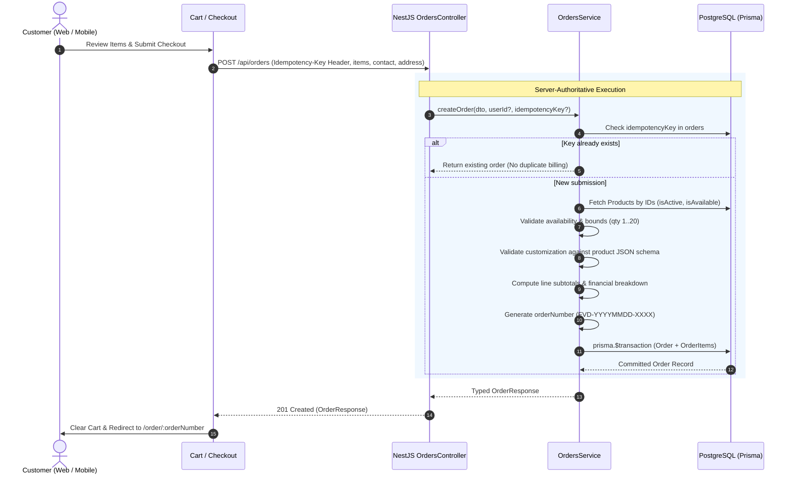

# Orders & Server-Authoritative Pricing Architecture

## 1. Core Security & Design Principles

### Zero-Trust Client Pricing

The Family Vaishno Dhaba ordering engine strictly adheres to a **zero-trust model for client input**:

- **No Client Prices Accepted**: The client never transmits item prices, customization surcharges, line totals, subtotal, delivery charges, or taxes.
- **Server Reconstruction**: The server queries PostgreSQL for each `productId`, verifies item status (`isActive` and `isAvailable`), validates customization choices against the authoritative `customizationOptions` JSON schema, and computes unit prices and totals on the server.
- **Immutable Snapshots**: Line items store immutable historical snapshots (`productName`, `baseUnitPrice`, `customization`, `customizationPrice`, `unitPrice`, `quantity`, `subtotal`) in `order_items` so that future menu or pricing modifications never alter past order records.

---

## 2. Order Creation Flow



---

## 3. Idempotency & Concurrency Protection

To prevent duplicate orders due to client retries, double clicks, or flaky cellular networks:

1. The frontend generates a unique `Idempotency-Key` (UUID v4) on initial checkout submission.
2. The key is stored as a `@unique` index on the `orders` table in PostgreSQL.
3. If a request arrives with an existing `idempotencyKey`, `OrdersService` returns the previously created order safely without creating new database rows or generating duplicate charges.

---

## 4. Fulfillment & Address Rules

- **DELIVERY**: Requires valid `deliveryAddress` (minimum 5 characters), `city`, and a 6-digit Indian PIN code (`/^\d{6}$/`).
- **TAKEAWAY**: Pickup directly from the dhaba kitchen desk (Kangra Main Chowk). Address fields are not required.

---

## 5. Endpoints Specification

| Method | Path                      | Auth Guard    | Description                                                                             |
| :----- | :------------------------ | :------------ | :-------------------------------------------------------------------------------------- |
| `POST` | `/api/orders`             | Optional      | Create new order (supports guest and authenticated users) with `Idempotency-Key` header |
| `GET`  | `/api/orders/:identifier` | Public        | Retrieve live order status and snapshot details by `orderNumber` or `id`                |
| `GET`  | `/api/orders/my-orders`   | Authenticated | Retrieve authenticated customer's past order history                                    |

---

## 6. Automated Test Suite

To run the automated pricing and constraint verification tests:

```bash
npx tsx scripts/verify-orders.ts
```
