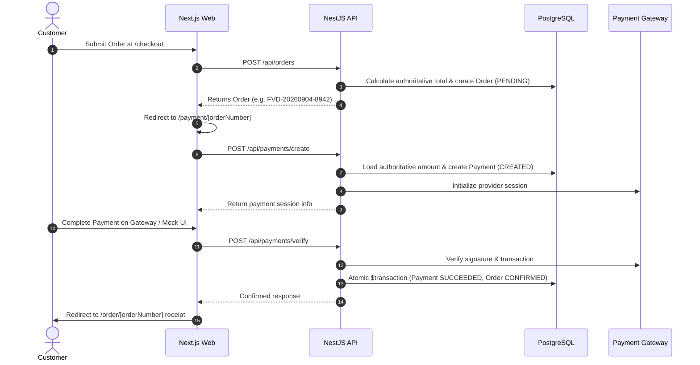

# Production Payment Architecture & Payment Abstraction

## 1. Overview

The Family Vaishno Dhaba payment system provides a secure, decoupled payment architecture designed for online ordering. It establishes a minimal provider abstraction, database-authoritative pricing, state-machine-driven payment transactions, HMAC-secured webhooks, and strict customer ownership isolation.

---

## 2. Core Security & Architectural Principles

### 2.1 Server-Authoritative Pricing & Currency

- The payable amount is **always** retrieved from PostgreSQL `Order.totalAmount`.
- Client-supplied `amount`, `currency`, `userId`, `orderStatus`, or `paymentStatus` fields in request bodies are stripped and ignored by whitelist validation pipes.
- Operating currency is hard-locked to `INR` (Indian Rupee).

### 2.2 Frontend Callback Is NOT Proof of Payment

> [!IMPORTANT]
> **A frontend payment-success callback is never sufficient to mark an order as paid.**
> The browser merely initiates and facilitates the payment flow. The backend verifies payment validity either via trusted provider-side verification (`POST /api/payments/verify`) or signed server-to-server webhooks (`POST /api/payments/webhook`).

### 2.3 Strict Customer Ownership & Isolation

- For registered customers, the backend derives `userId` strictly from session authentication cookies (`@CurrentUser()`).
- Any attempt to create or verify payment for an order belonging to another customer is rejected with `404 Not Found` (preventing ID probing and enumeration).

### 2.4 Payment & Webhook Idempotency

- **Creation Idempotency**: If a payment attempt in `CREATED` or `PENDING` state already exists for an order, calling `POST /api/payments/create` returns the active transaction without creating duplicate database rows.
- **Webhook Idempotency**: Payment providers can redeliver webhooks. If a transaction is already marked `SUCCEEDED`, duplicate webhooks are safely acknowledged with no duplicate transitions or database writes.
- **Verification Idempotency**: Calling `/api/payments/verify` on an already-completed transaction returns the existing confirmed state without duplicating actions or audit logs.

### 2.5 Atomic State Transitions

- Payment state transitions (`SUCCEEDED`) and Order status updates (`CONFIRMED` / `COMPLETED`) execute inside a single atomic database transaction (`prisma.$transaction`).
- Failed payments transition the `Payment` record to `FAILED`, leaving the `Order` in an unpaid `PENDING` state to allow safe customer retries without duplicating the original order.

---

## 3. Database Model & Relationships

```prisma
enum PaymentTransactionStatus {
  CREATED
  PENDING
  SUCCEEDED
  FAILED
  REFUNDED
}

model Payment {
  id                String                   @id @default(cuid())
  orderId           String
  provider          String                   // e.g. "MOCK", "RAZORPAY", "STRIPE"
  providerPaymentId String?                  @unique
  providerOrderId   String?
  amount            Decimal                  @db.Decimal(10, 2)
  currency          String                   @default("INR")
  status            PaymentTransactionStatus @default(CREATED)
  errorMessage      String?
  metadata          Json?
  paidAt            DateTime?
  createdAt         DateTime                 @default(now())
  updatedAt         DateTime                 @updatedAt

  order             Order                    @relation(fields: [orderId], references: [id], onDelete: Cascade)

  @@index([orderId])
  @@index([status])
  @@index([providerPaymentId])
  @@map("payments")
}
```

---

## 4. Payment Provider Abstraction

The system interfaces with payment gateways through the `PaymentProvider` abstraction:

```typescript
export interface PaymentProvider {
  readonly name: string;
  createPayment(params: CreatePaymentParams): Promise<PaymentCreationResult>;
  verifyPayment(
    params: VerifyPaymentParams,
  ): Promise<PaymentVerificationResult>;
  handleWebhook(
    rawBody: string | Buffer,
    headers: Record<string, string | string[] | undefined>,
  ): Promise<WebhookEventResult>;
}
```

### Development Mock Provider (`PAYMENT_PROVIDER=mock`)

- Used for development and automated integration testing without requiring third-party credentials.
- Computes HMAC SHA-256 signatures using `PAYMENT_WEBHOOK_SECRET` for webhook validation.
- Simulates both verified payment success and failure flows.

---

## 5. Backend REST Endpoints

All endpoints are exposed under `/api/payments`:

| Method | Endpoint                       | Protection                        | Description                                                                   |
| ------ | ------------------------------ | --------------------------------- | ----------------------------------------------------------------------------- |
| `POST` | `/api/payments/create`         | `OptionalAuthGuard`, Throttled    | Initiates or retrieves an active payment session for an order.                |
| `POST` | `/api/payments/verify`         | `OptionalAuthGuard`, Throttled    | Verifies provider payment signature and transitions order to CONFIRMED.       |
| `GET`  | `/api/payments/order/:orderId` | `OptionalAuthGuard`               | Retrieves active payment transaction info for an order.                       |
| `POST` | `/api/payments/webhook`        | Public (HMAC Verified), Throttled | Receives asynchronous provider notifications with raw body HMAC verification. |

---

## 6. Frontend Payment Flow



---

## 7. Environment Configuration

```env
# ------------------------------------------------------------------------------
# Payments Gateway
# ------------------------------------------------------------------------------
PAYMENT_PROVIDER=mock
PAYMENT_WEBHOOK_SECRET=dev_mock_webhook_secret_fvd_2026
PAYMENT_KEY_ID=
PAYMENT_KEY_SECRET=
```

---

## 8. Automated Verification

The automated verification suite (`scripts/verify-payments.ts`) verifies:

1. Authoritative amount & currency derivation from PostgreSQL.
2. Payment creation idempotency (no duplicate records).
3. Cross-customer access isolation (404 rejection).
4. Atomic state transitions on payment verification.
5. Ineligible order protection (completed and cancelled orders).
6. Safe payment failure and fresh retry session creation.
7. Webhook HMAC signature verification and webhook idempotency.
